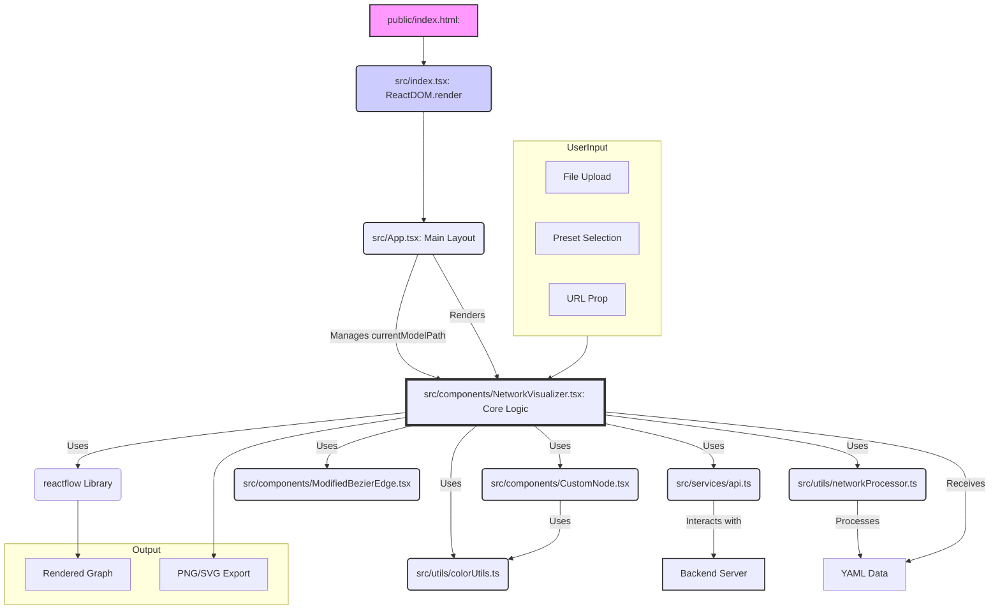

# Neural Network Architecture Visualizer

## Overall Frontend Architecture:

The application is a single-page application (SPA) built with React and TypeScript. It uses the `reactflow` library to render interactive network graphs based on YAML configuration files.

**1. Entry Point and Initialization:**

*   **`public/index.html`**: This is the standard HTML file that gets served to the browser. It contains a single `div` with the ID `root` (i.e., `

`). This div acts as the container where the entire React application will be mounted.
*   **`src/index.tsx`**: This is the main entry point for the JavaScript/TypeScript code.
    *   It imports the `App` component.
    *   It uses `ReactDOM.createRoot()` to get a reference to the `root` div from `index.html`.
    *   It then calls `root.render(<App />)` to render the main `App` component into that div. This kicks off the React application.
    *   It also includes some global error handling, specifically to suppress `ResizeObserver` errors which can be common in complex layouts.

**2. Main Application Component:**

*   **`src/App.tsx`**: This component serves as the top-level container for the application's UI.
    *   It defines the overall page structure, including a header (with title, links to documentation/GitHub, and the current model path) and a main content area.
    *   The most important thing it does is render the `<NetworkVisualizer />` component in its main content area.
    *   It manages a piece of state called `currentModelPath` and a function `handleModelPathChange`. These are passed as props to `NetworkVisualizer` to keep track of and display the path of the YAML model currently being viewed, which is especially useful when navigating into nested sub-models.

**3. Core Visualization Component:**

*   **`src/components/NetworkVisualizer.tsx`**: This is the most complex and central component of the frontend. It's responsible for almost all the dynamic functionality related to fetching, processing, and displaying the network graphs.
    *   **Data Input:** It can receive YAML data in several ways:
        *   As a direct string prop (`yamlContent`).
        *   As a URL prop pointing to a YAML file (`yamlUrl`).
        *   Through user file uploads (single YAML file or a folder of YAML files).
        *   By selecting pre-uploaded configurations (presets).
    *   **API Interaction (`src/services/api.ts`):** It heavily relies on functions defined in `src/services/api.ts` to communicate with the backend. This includes:
        *   Uploading YAML files/folders for processing.
        *   Fetching YAML data from URLs or presets.
        *   Requesting subgraph configurations when a user "drills down" into a complex node.
        *   Sending images (PNGs) to the backend for cropping during export.
    *   **Graph Processing (`src/utils/networkProcessor.ts`):** Once it has the YAML data (either from props, upload, or API), it uses utility functions (primarily `processNetworkStructure` from `src/utils/networkProcessor.ts`) to convert this hierarchical YAML data into a flat list of nodes and edges that `reactflow` can understand.
    *   **Rendering with React Flow:**
        *   It uses the `reactflow` library to render the actual graph.
        *   It manages the `nodes` and `edges` state for React Flow.
        *   It defines and uses custom components for nodes (`src/components/CustomNode.tsx`) and edges (`src/components/ModifiedBezierEdge.tsx`) to control their appearance and behavior.
    *   **User Interaction:**
        *   Handles user actions like file uploads, preset selection, zooming/panning the graph, exporting the graph as PNG/SVG, and toggling edge labels.
        *   Crucially, it handles double-clicks on nodes (`handleNodeDoubleClick` in `CustomNode.tsx` calls a handler in `NetworkVisualizer.tsx`). If a node represents a nested model (subgraph), this action triggers a request to the backend (via `api.ts`) to fetch the configuration for that subgraph. The `NetworkVisualizer` then processes this new configuration and updates the display to show the subgraph.
    *   **Navigation and State:**
        *   It maintains a history stack to allow users to "Go Back" after navigating into subgraphs.
        *   It updates the `currentModelPath` (via the prop from `App.tsx`) as the user navigates.
    *   **UI Elements:** It renders controls (zoom, fit view), a minimap, and panels for user actions (upload buttons, export buttons, etc.).

**4. Supporting Components and Utilities:**

*   **`src/components/CustomNode.tsx`**: Defines the visual representation and interactive behavior of each node in the graph. It receives data about the module it represents and handles events like double-clicks to trigger subgraph loading. It uses `src/utils/colorUtils.ts` to determine its background color.
*   **`src/components/ModifiedBezierEdge.tsx`**: Defines how the connections (edges) between nodes are drawn. It can display labels on edges if toggled.
*   **`src/services/api.ts`**: This file abstracts all communication with the backend server. It contains functions for uploading files, fetching data, processing YAML, etc. This keeps the API logic separate from the UI components.
*   **`src/utils/networkProcessor.ts`**: Contains the core logic for transforming the input YAML configuration (which can be nested and complex) into a list of nodes and edges with positions suitable for `reactflow`.
*   **`src/utils/colorUtils.ts`**: Provides helper functions to determine the background color of nodes based on their properties (e.g., if they are input, output, or regular modules).
*   **`src/types/index.ts`**: Contains TypeScript type definitions (interfaces) for the data structures used throughout the application (e.g., `YamlConfig`, `ModuleNodeData`, `ModuleEdgeData`). This helps ensure type safety and better code understanding.

**Simplified Data Flow for Displaying a Graph:**

1.  **User Action:** User uploads a YAML file (or selects a preset, or a URL is provided).
2.  **`NetworkVisualizer.tsx`:**
    *   Receives the file/data.
    *   Calls `api.ts` to upload/fetch and process the YAML with the backend.
    *   Backend (or `api.ts` for some local parsing) returns a structured `YamlConfig` object.
3.  **Graph Generation:**
    *   `NetworkVisualizer.tsx` passes this `YamlConfig` to `processNetworkStructure` (in `networkProcessor.ts`).
    *   `networkProcessor.ts` calculates node positions, connections, etc., and returns lists of processed nodes and edges.
4.  **Rendering:**
    *   `NetworkVisualizer.tsx` updates its `nodes` and `edges` state with this data.
    *   `reactflow` detects the state change and re-renders the graph, using `CustomNode.tsx` for each node and `ModifiedBezierEdge.tsx` for each edge.
5.  **Display:** The user sees the rendered network graph.

**Relationship Summary Diagram (Mermaid):**

